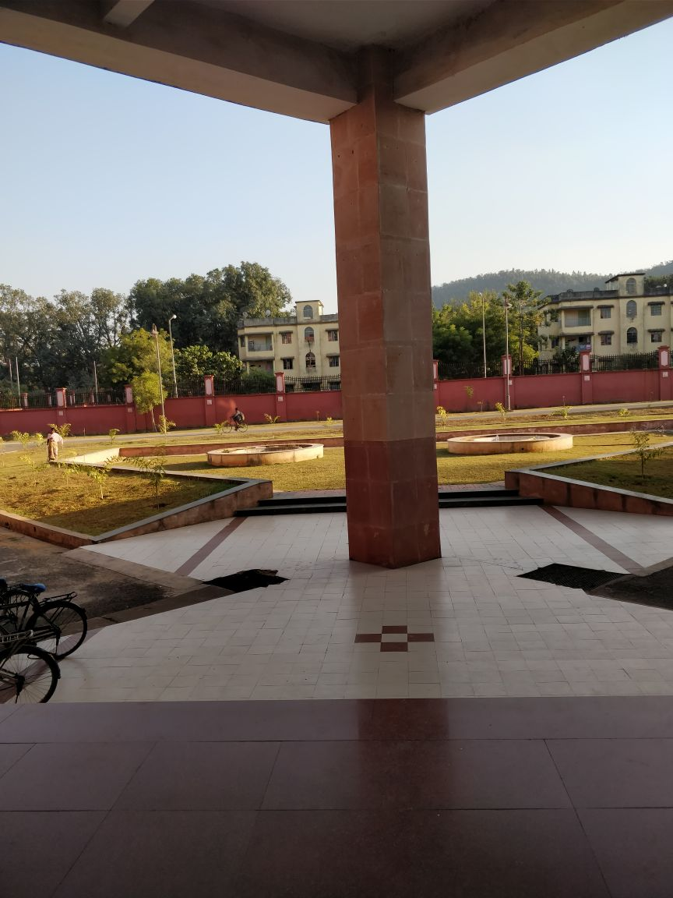
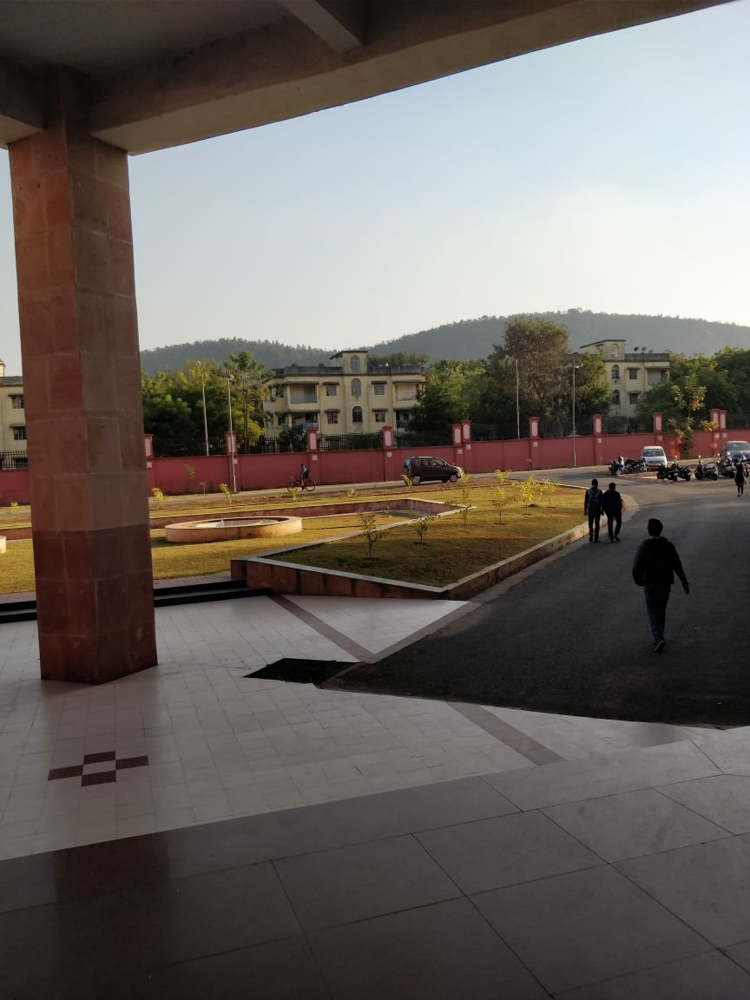
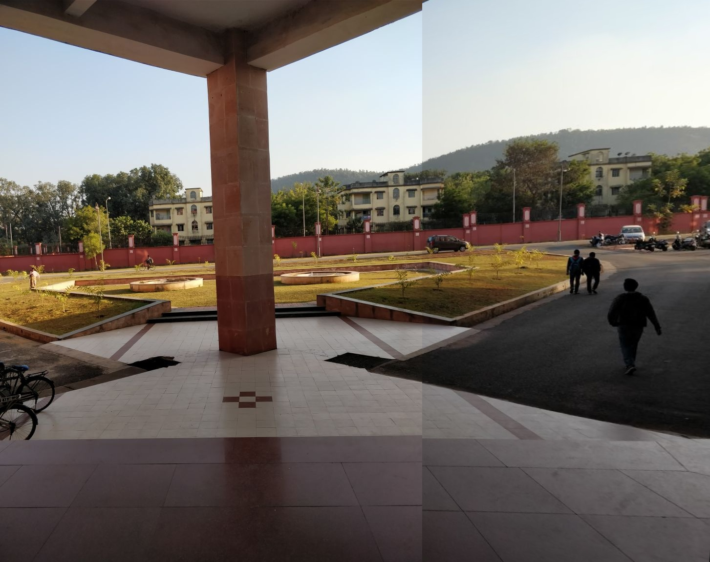
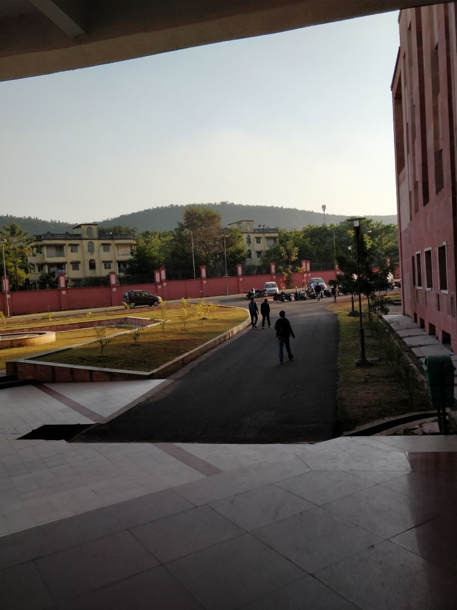
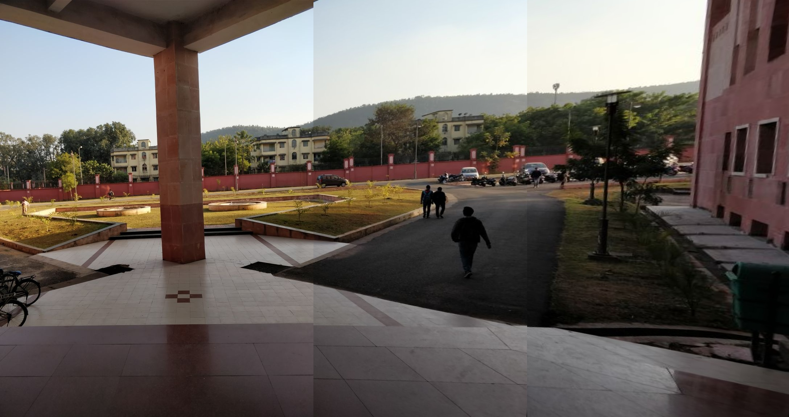

# Image Mosaicing
This project of mine is the implementation of some computer vision and linear algebra methods to stich images. These images were taken by a person who was standing at one point and rotating his camera from left to right to take several overlapping images.  

| Input 1  | Input 2 | Stiched Output |
| ------------- | ------------- | ------------- |
|   |  |  

| Input 1  | Input 2 | Input 3 | Stiched Output |
| ------------- | ------------- | ------------- | ------------- |
|   |  |  |  

## Theory-cum-steps 
1. Find key points in both the images
2. Keypoints between two images are matched by identifying their nearest neighbours. But in some cases, the second closest-match may be very near to the first. It may happen due to noise or some other reasons. In that case, ratio of closest-distance to second-closest distance is taken. 
3. Theoretically, we need 9 matchings to estimate the homography matrix but the libraries select a bunch of them, detect outliers if any using the RANSAC algorithm, and then solve equations to estimate the homography matrix.
4. Then that homography matrix is used to generate a perspective for stitching the images together.

## Required Packages

Use the package manager [pip](https://pip.pypa.io/en/stable/) 

1. OpenCV
2. Numpy
3. matplotlib (for visualization)

## Usage

```
python panorama.py path/to/img/ path/to/img/ 
```
This program can stich more than 2 images as well. Refer to the below given example.
```
python panorama.py images/ec1.jpeg images/ec2.jpeg images/ec3.jpeg
```

## License
[MIT](https://choosealicense.com/licenses/mit/)
